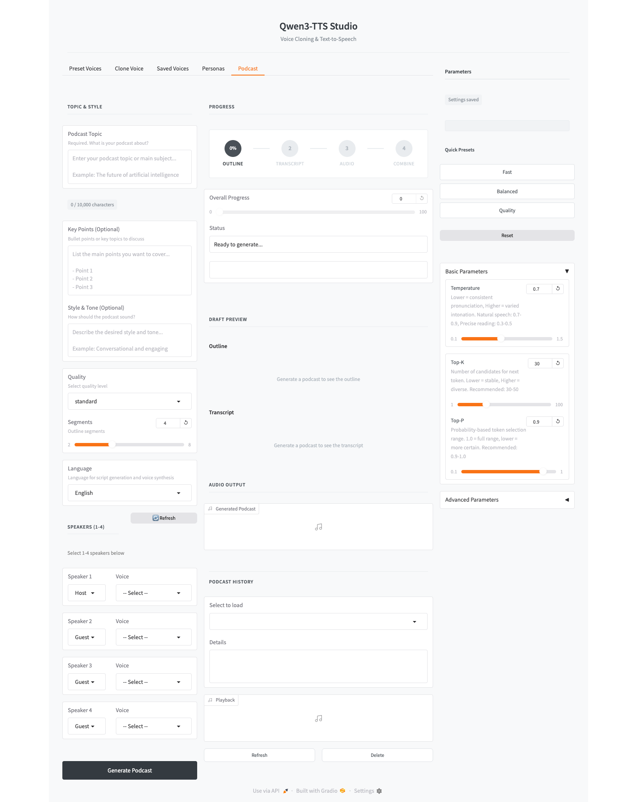

# Qwen3-TTS Studio

A professional-grade interface for [Qwen3-TTS](https://github.com/QwenLM/Qwen3-TTS), designed to unlock the model's full potential with fine-grained control and intuitive workflows.



## Why This Project?

Qwen3-TTS is a powerful text-to-speech model, but using it directly requires dealing with complex parameters, manual prompt engineering, and repetitive boilerplate code. **Qwen3-TTS Studio** was created to solve these problems:

- **Fine-tuned Control**: Easily adjust temperature, top-k, top-p, and other parameters with real-time presets (Fast / Balanced / Quality)
- **Better Results**: Optimized default settings and automatic token management to avoid common issues like silent audio or distorted output
- **Intuitive UI/UX**: Clean, modern interface that makes voice generation accessible to everyone
- **Automated Podcasts**: Generate complete podcasts from just a topic - AI writes the script, assigns voices, and synthesizes audio automatically

## Features

### Voice Generation
- **Voice Clone**: Clone any voice with just a 3-second audio sample
- **Custom Voice**: 9 preset voices with style control (Vivian, Serena, Ryan, etc.)
- **Voice Design**: Describe your desired voice in natural language
- **10 Language Support**: Korean, English, Chinese, Japanese, German, French, Russian, Portuguese, Spanish, Italian

### Podcast Generation
- **One-Click Podcasts**: Enter a topic, get a complete podcast
- **AI Script Writing**: GPT-powered outline and transcript generation
- **Multi-Speaker Support**: Assign different voices to each speaker
- **Custom Personas**: Create and save speaker personalities

### Quality of Life
- **Parameter Presets**: Quick presets for different use cases
- **Generation History**: Browse, search, and replay past generations
- **Auto-Save Settings**: Your preferences persist across sessions
- **Real-time Feedback**: Character count, generation time, and status indicators

## Requirements

- Python 3.12+
- macOS (MPS) / Linux (CUDA)
- 16GB+ RAM
- OpenAI API Key (for Podcast feature)

## Installation

### 1. Clone Repository

```bash
git clone https://github.com/bc-dunia/qwen3-TTS-studio.git
cd qwen3-TTS-studio
```

### 2. Create Virtual Environment

```bash
conda create -n qwen3-tts python=3.12 -y
conda activate qwen3-tts
```

### 3. Install Dependencies

```bash
pip install -U qwen-tts
pip install gradio soundfile numpy moviepy openai
```

For CUDA users:
```bash
pip install -U flash-attn --no-build-isolation
```

### 4. Download Models

Download models from **HuggingFace** or **ModelScope**.

#### HuggingFace (Recommended)

```bash
pip install -U "huggingface_hub[cli]"

# Required models
huggingface-cli download Qwen/Qwen3-TTS-Tokenizer-12Hz --local-dir ./Qwen3-TTS-Tokenizer-12Hz
huggingface-cli download Qwen/Qwen3-TTS-12Hz-1.7B-Base --local-dir ./Qwen3-TTS-12Hz-1.7B-Base
huggingface-cli download Qwen/Qwen3-TTS-12Hz-1.7B-CustomVoice --local-dir ./Qwen3-TTS-12Hz-1.7B-CustomVoice

# Optional models
huggingface-cli download Qwen/Qwen3-TTS-12Hz-0.6B-Base --local-dir ./Qwen3-TTS-12Hz-0.6B-Base
huggingface-cli download Qwen/Qwen3-TTS-12Hz-0.6B-CustomVoice --local-dir ./Qwen3-TTS-12Hz-0.6B-CustomVoice
huggingface-cli download Qwen/Qwen3-TTS-12Hz-1.7B-VoiceDesign --local-dir ./Qwen3-TTS-12Hz-1.7B-VoiceDesign
```

#### ModelScope (For users in China)

```bash
pip install -U modelscope

modelscope download --model Qwen/Qwen3-TTS-Tokenizer-12Hz --local_dir ./Qwen3-TTS-Tokenizer-12Hz
modelscope download --model Qwen/Qwen3-TTS-12Hz-1.7B-Base --local_dir ./Qwen3-TTS-12Hz-1.7B-Base
modelscope download --model Qwen/Qwen3-TTS-12Hz-1.7B-CustomVoice --local_dir ./Qwen3-TTS-12Hz-1.7B-CustomVoice
```

### 5. Environment Variables

Create a `.env` file:

```bash
OPENAI_API_KEY=your_openai_api_key_here
```

## Usage

### Start Server

```bash
python qwen_tts_ui.py
```

Open `http://127.0.0.1:7860` in your browser.

### Available Models

| Model | Features | Size |
|-------|----------|------|
| 1.7B-CustomVoice | 9 preset voices + style control | 4.2GB |
| 1.7B-Base | Voice Clone (3-sec sample) | 4.2GB |
| 1.7B-VoiceDesign | Natural language voice design | 4.2GB |
| 0.6B-CustomVoice | 9 preset voices (lightweight) | 2.3GB |
| 0.6B-Base | Voice Clone (lightweight) | 2.3GB |

### Preset Voices

| Speaker | Description | Native Language |
|---------|-------------|-----------------|
| Vivian | Bright, slightly sharp young female | Chinese |
| Serena | Warm, soft young female | Chinese |
| Ryan | Dynamic male with strong rhythm | English |
| Aiden | Bright American male, clear midrange | English |
| Ono_Anna | Lively Japanese female | Japanese |
| Sohee | Warm Korean female, rich emotion | Korean |

## Project Structure

```
qwen3-TTS-studio/
├── qwen_tts_ui.py              # Main entry point
├── config.py                   # Configuration
│
├── ui/                         # UI Components
│   ├── content_input.py        # Content input section
│   ├── draft_editor.py         # Draft editing
│   ├── draft_preview.py        # Outline/transcript preview
│   ├── persona.py              # Persona management UI
│   ├── progress.py             # Progress indicators
│   └── voice_cards.py          # Voice selection cards
│
├── podcast/                    # Podcast Generation
│   ├── orchestrator.py         # Main orchestration
│   ├── models.py               # Pydantic models
│   ├── outline.py              # AI outline generation
│   ├── transcript.py           # AI transcript generation
│   ├── prompts.py              # LLM prompts
│   └── session.py              # Session management
│
├── audio/                      # Audio Processing
│   ├── generator.py            # TTS generation
│   ├── batch.py                # Batch processing
│   ├── combiner.py             # Audio concatenation
│   └── model_loader.py         # Model loading
│
└── storage/                    # Data Persistence
    ├── history.py              # Podcast history
    ├── persona.py              # Persona storage
    ├── persona_models.py       # Persona models
    └── voice.py                # Voice management
```

## Acknowledgments

This project is built on top of the excellent [Qwen3-TTS](https://github.com/QwenLM/Qwen3-TTS) model by Alibaba Qwen team.

- **HuggingFace**: https://huggingface.co/collections/Qwen/qwen3-tts
- **ModelScope**: https://modelscope.cn/collections/Qwen/Qwen3-TTS
- **Paper**: https://arxiv.org/abs/2601.15621
- **Blog**: https://qwen.ai/blog?id=qwen3tts-0115

## License

This project uses Qwen3-TTS models. Please refer to the [Qwen3-TTS License](https://github.com/QwenLM/Qwen3-TTS/blob/main/LICENSE) for model usage terms.
